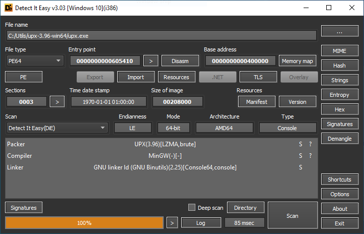
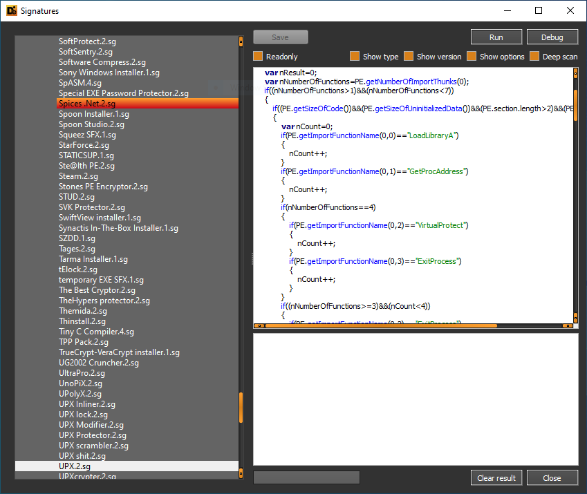

[](https://www.paypal.com/cgi-bin/webscr?cmd=_s-xclick&hosted_button_id=NF3FBD3KHMXDN)
[](http://ntinfo.biz)
[](http://ntinfo.biz)
[](https://github.com/horsicq/XTranslation)

**Detect It Easy (DiE)** is a powerful tool for file type identification, popular among **malware analysts**, **cybersecurity experts**, and **reverse engineers** worldwide. Supporting both **signature-based** and **heuristic analysis**, DiE enables efficient file inspections across a broad range of platforms, including **Windows, Linux, and MacOS**. Its adaptable, script-driven detection architecture makes it one of the most versatile tools in the field, with a comprehensive list of supported OS images.

## 🚀 Getting Started

-   **[💎 Download release](https://github.com/horsicq/DIE-engine/releases)**
-   **[🧪 Download dev/beta](https://github.com/horsicq/DIE-engine/releases/tag/Beta)**
-   **[🚀 DIE API Library (for Developers)](https://github.com/horsicq/die_library)**
-   [📋 Changelog](https://github.com/horsicq/Detect-It-Easy/blob/master/changelog.txt)
-   [💬 Contribute to Translations](https://github.com/horsicq/XTranslation)



## 💡 Why Use Detect It Easy?

Detect It Easy’s **flexible signature system** and **scripting capabilities** make it an essential tool for **malware analysis** and **digital forensics**. With traditional static analyzers often limited in scope and prone to false positives, DiE’s customizable design enables precise integration of new detection logic, ensuring reliable results across diverse file types.



### Key Advantages:

-   **Flexible Signature Management**: Easily create, modify, and optimize signatures.
-   **Cross-Platform Support**: Runs on Windows, Linux, and MacOS.
-   **Minimal False Positives**: Combined signature and heuristic analysis ensures high detection accuracy.

## 📄 Supported File Types

Detect It Easy supports a wide range of executable and archive types, including:

-   **PE** (Portable Executable format for Windows)
-   **ELF** (Executable and Linkable Format for Linux)
-   **APK** (Android Application Package)
-   **IPA** (iOS Application Package)
-   **JAR** (Java Archive)
-   **ZIP** (Compressed archives)
-   **ISO9660** (Optical media format)
-   **DEX** (Dalvik Executable for Android)
-   **MS-DOS** (MS-DOS executable files)
-   **COM** (Simple executable format for DOS)
-   **LE/LX** (Linear Executable for OS/2)
-   **MACH** (Mach-O files for MacOS)
-   **NPM** (JavaScript packages)
-   **Amiga** (Executable format for Amiga computers)
-   **Binary** (Other unclassified files)

And that's not all... The list is expanding as the tool is updated

Unknown formats undergo heuristic analysis, providing identification for both known and unrecognized files.

## 🔑 Key Features

-   **Flexible Signature Management**: Define or modify detection signatures.
-   **Scripted Detection**: Use a JavaScript-like scripting language (DiE-JS runtime) for custom detection algorithms.
-   **Cross-Platform Compatibility**: Available for Windows, Linux, and MacOS.
-   **Reduced False Positives**: Combines signature and heuristic scanning for accuracy.

## 📥 Installation

### 📦 Install via Package Managers

-   **Windows**:

    -   [Chocolatey](https://community.chocolatey.org/packages/die)
    -   [Microsoft Store](https://apps.microsoft.com/detail/9nq58d7ghb2x)

-   **Linux**:

    -   **Parrot OS**: Package name `detect-it-easy`
    -   **Arch Linux**: AUR package [detect-it-easy-git](https://aur.archlinux.org/packages/detect-it-easy-git/)
    -   **openSUSE**: [OBS](https://build.opensuse.org/package/show/home:mnhauke/detect-it-easy)
    -   **REMnux**: Malware analysis distribution

    [](https://repology.org/project/detect-it-easy/versions)

> [!NOTE]
> Use **Detect It Easy** bot via **Telegram** to quickly check files: [**@detectiteasy_bot**](https://t.me/detectiteasy_bot)

### ⚙️ Build from Source

See the [BUILD.md](docs/BUILD.md) for detailed instructions.

### 🐳 Docker Installation

Run DiE in a Docker container:

```bash
git clone --recursive https://github.com/horsicq/Detect-It-Easy
cd Detect-It-Easy/
docker build . -t horsicq:diec
```

## 🖥️ Usage

Detect It Easy offers three versions:

-   **die** - Graphical interface.
-   **diec** - Command-line version for batch processing.
-   **diel** - Lightweight GUI version. (scanner only)

For detailed usage, refer to the [RUN.md](docs/RUN.md).

### 🔎 Example Use Cases

-   🦠 **Malware Analysis**: Identify file types, packers, or protections.
-   🛡 **Security Audits**: Determine executable file types and potential security risks.
-   🔎 **Software Forensics**: Inspect software components and validate compliance.

## 🏆 Special thanks

-   ⭐️ **Thanks to [DosX](https://github.com/DosX-dev)**

-   ⭐️ Thanks to [PELock](https://www.pelock.com)

## 🤝 Thanks to all contributors

<a href="https://github.com/horsicq/Detect-It-Easy/graphs/contributors">

</a>

---


<!-- Dinosaur -->
<!--
                        . - ~ ~ ~ - .
      ..     _      .-~               ~-.
     //|     \ `..~                      `.
    || |      }  }              /       \  \
(\   \\ \~^..'                 |         }  \
 \`.-~  o      /       }       |        /    \
 (__          |       /        |       /      `.
  `- - ~ ~ -._|      /_ - ~ ~ ^|      /- _      `.
              |     /          |     /     ~-.     ~- _
              |_____|          |_____|         ~ - . _ _~_-_
-->
