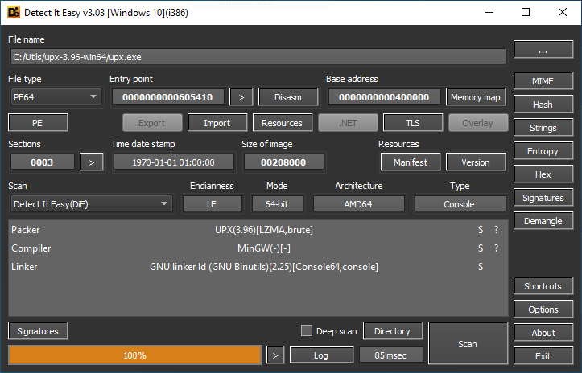
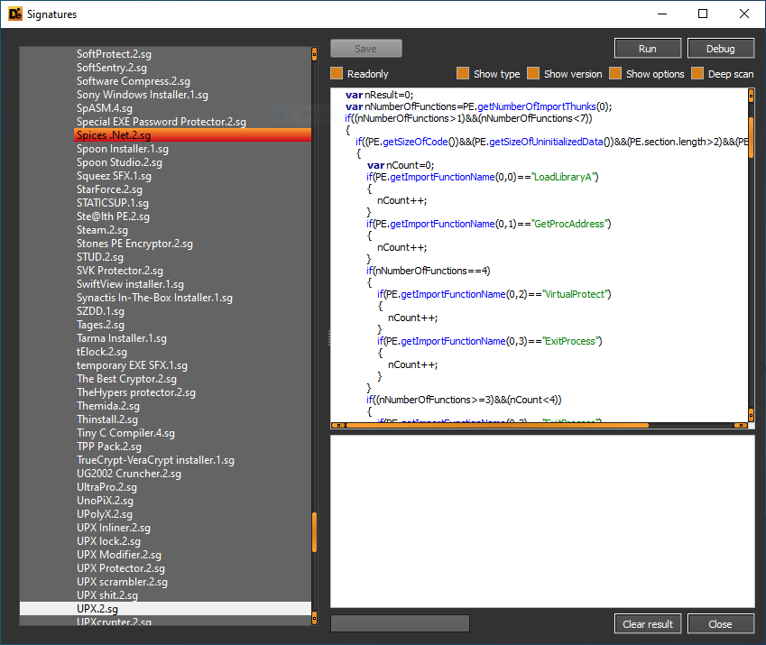

[](https://www.paypal.com/cgi-bin/webscr?cmd=_s-xclick&hosted_button_id=NF3FBD3KHMXDN)
[](http://ntinfo.biz)
[](http://ntinfo.biz)
[](https://github.com/horsicq/XTranslation)

**Detect It Easy (DiE)** is a powerful tool for file type identification, popular among **malware analysts**, **cybersecurity experts**, and **reverse engineers** worldwide. Supporting both **signature-based** and **heuristic analysis**, DiE enables efficient file inspections across a broad range of platforms, including **Windows, Linux, and MacOS**. Its adaptable, script-driven detection architecture makes it one of the most versatile tools in the field, with a comprehensive list of supported OS images.

## 🚀 Getting started

-   **[💎 Download release/beta](https://github.com/horsicq/DIE-engine/releases)**
-   **[🧪 DiE API Library (for Developers)](https://github.com/horsicq/die_library)**
-   [📋 Changelog](https://github.com/horsicq/Detect-It-Easy/blob/master/changelog.txt)
-   [💬 Contribute to Translations](https://github.com/horsicq/XTranslation)



## 💡 Why use Detect It Easy?

Detect It Easy’s **flexible signature system** and **scripting capabilities** make it an essential tool for **malware analysis** and **digital forensics**. With traditional static analyzers often limited in scope and prone to false positives, DiE’s customizable design enables precise integration of new detection logic, ensuring reliable results across diverse file types.



### Key advantages:

-   **Flexible Signature Management**: Easily create, modify, and optimize detection scripts (rules).
-   **Cross-Platform Support**: Runs on Windows, Linux, and MacOS.
-   **Minimal False Positives**: Combined signature and heuristic analysis ensures high detection accuracy.

## 🧠 Heuristic engine

### PE analysis that goes beyond a signature match

A signature can tell you what a file resembles. The [Generic Heuristic Analysis engine](db/PE/__GenericHeuristicAnalysis_By_DosX.7.sg) goes further: it tries to explain what is unusual about the file and why it deserves a closer look. The PE heuristic engine is created and maintained by [DosX](https://github.com/DosX-dev).

With heuristic scanning enabled, DiE makes a series of independent passes over native and managed PE images. The file is never launched. Instead, the engine works with headers, data directories, sections, imports, exports, resources, .NET metadata, bytecode, overlays, debug records, and code around the entry point. This makes it useful both when an exact signature is known and when a sample has been modified enough to evade ordinary identification.

One of these passes performs **surface-level emulation of native instructions around the entry point**. It is deliberately lightweight rather than a sandbox or full CPU emulator, but it is enough to expose unusual instruction sequences, proxy jumps, stack tricks, NOP padding, hidden TLS entry points, and other patterns often left by packers or hand-written stubs.

These are the main passes rather than a complete inventory of every check:

|     | Area                         | What is checked                                                                                                                                                                                                                                                                            |
| --: | ---------------------------- | ------------------------------------------------------------------------------------------------------------------------------------------------------------------------------------------------------------------------------------------------------------------------------------------ |
|  🧩 | **.NET obfuscation**         | Modified managed entry points, odd CLR constructors and sections, control-flow tricks, integer confusion, encrypted strings, invalid opcodes, anti-tamper, fake metadata, watermarks, and virtualization-like code.                                                                        |
|  🕵️ | **.NET anti-analysis**       | Anti-debug and anti-dump code; checks aimed at dnSpy, ILSpy, SandBoxie, Cuckoo, Wine, VMs, and some security products.                                                                                                                                                                     |
|  🧱 | **Native anomalies**         | DOS area, IAT/EAT, TLS, imports and exports, section permissions, RWX memory, image flags, linker values, empty directories, and suspicious entry-point placement.                                                                                                                         |
|  📦 | **Packers and protectors**   | Packers, cryptors, SFX archives, RunPE-like behavior, compression and crypto clues, overlays, resources, .NET object sets, high entropy, embedded PE files, and damaged unpacking results. This pass also uses the large database of positional import hashes and section-name signatures. |
|  🔑 | **Licensing / DRM**          | .NET licensing APIs and attributes, license managers, activation strings, SteamStub, Denuvo markers, and similar traces.                                                                                                                                                                   |
|  🩺 | **Format integrity**         | Broken headers or entry points, bad alignment, relocations, IAT/EAT/resources, CLR metadata and version strings, Authenticode tampering. Quite useful on dumps and half-reconstructed files.                                                                                               |
|  🧾 | **Debug leftovers**          | Debug sections, exported symbols, .NET Native data, absolute or portable PDB paths, embedded PDBs, and Costura.Fody artifacts.                                                                                                                                                             |
|  ☣️ | **Malware-related patterns** | Correlations between imports, strings, bytecode, opcodes, metadata, resources, payload markers, and PE structure. Used for RATs, stealers, lockers, file infectors, hidden payloads, fake system files, and known families.                                                                |
|  🛠️ | **Toolchain / platform**     | Extra compiler, linker, and language clues in verbose mode, plus Windows-facing markers such as AppContainer and Game Definition File data.                                                                                                                                                |
|  🏷️ | **Filename anomalies**       | Missing or custom extensions, legitimate PE extensions other than `.exe`/`.dll`, misleading names, and application images carrying a `.dll` suffix.                                                                                                                                        |

This is not a black-box malware score. DiE reports the evidence it found so that an analyst can distinguish a broken file, an unusual build, a protected commercial application, and a genuinely suspicious sample. A heuristic result is a lead, not automatic proof of malicious intent. Use `--heuristicscan` together with `--verbose` to see the fullest report.

### Malware clues without pretending to be an antivirus

DiE is **not an antivirus**, and the PE heuristic engine is not designed to declare a file safe. It provides no real-time protection or disinfection, and a clean report only means that the enabled rules did not find the static evidence they know how to recognize. Reputation services, an antivirus, dynamic analysis, and manual reverse engineering still answer different questions.

What DiE can do is expose a surprisingly broad range of threat-related clues while the file is still on disk. The examples below are only a small part of the actual rule set, not a complete catalogue. The heuristic engine evolves faster than this README and new families, markers, and cross-checks are added regularly.

-   **Remote-access trojans and backdoors**, including generic RAT patterns and families such as NjRAT, AsyncRAT, NanoCore, Orcus, Gh0st RAT, DarkComet, NetWire, Remcos, BitRAT, and many others.
-   **Stealers and spyware**, including generic stealer scoring, Mars Stealer, Echelon Stealer, StormKitty, MAX Spyware, and other family or behavior indicators.
-   **Ransomware, lockers, and destructive malware**, with checks for WannaCry, UX-Locker, Liberium WinLocker, Amp WinLocker, Olympic Destroyer, and related threats.
-   **File-infecting viruses.** Dedicated static infection checks currently cover **Ramnit, Neshta, Slugin, Win9X.CIH, Win9X.Dupator, Parite, and Polip**, with the list continuing to grow.
-   **Targeted and unusual threats**, including markers associated with Slingshot APT, Equation Group tooling, RAT injectors, maliciously generated assemblies, fake or infected system files, and similar cases.
-   **Hidden payloads and delivery techniques**, from Base64-encoded executables and RunPE-like behavior to PE files concealed in resources, sections, or overlays. A built-in known-plaintext attack (KPA) pass derives repeating XOR/XNOR, ADD/SUB, or reverse-subtraction keys up to 20 bytes from invariant PE-header fields, then validates the decoded image structurally instead of trusting a plain `MZ` match. Other payload and build anomalies are covered as well.

These are explainable static detections built from entry-point code, import fingerprints, metadata, strings, resources, section structure, and other relationships inside the image. They are valuable leads, but they are not a promise of complete malware-family coverage: modified samples may evade a rule, and an unusual clean program may share part of a suspicious pattern.

### Heuristic results stay visible

Heuristic findings are never silently mixed into ordinary signature matches. Every result produced by the heuristic layer is kept separate and marked with `(Heur)`, so it is always clear which conclusion came from an exact rule and which one was inferred from a combination of evidence.

The engine does more than append extra lines. In a few deliberate cases it can reject a misleading result from the main signature database and replace it with a more precise heuristic conclusion. Programming-language detection is a typical example: a compiler signature may suggest C or C++, while stronger structural and runtime evidence identifies Rust. The replacement still carries `(Heur)` and never passes itself off as an exact signature match. The same reconciliation mechanism is used to suppress known fake packer, protector, and dongle signatures left behind by obfuscators.

A protected .NET sample may produce a report like this:

```text
PE32
    Operation system: Windows (95) [I386, 32-bit, GUI]
    Linker: Microsoft Linker (6.0)
    Compiler: VB.NET
    Language: VB.NET
    Library: .NET Framework (CLR 2.0.50727)
    Protector: .NET Reactor (4.8-4.9) [Anti-ILDASM]
    (Heur) Cryptor: Generic [Assembly invoke + RSACryptoServiceProvider + RunPE + Section #2 (".rsrc") compressed + Section #2 (".rsrc") has wrong size + High entropy]
    (Heur) Protection: Obfuscation [Modified managed EP + Anti-ILDASM + Bad namings + Fake .cctor name + Math mutations]
```

For a native executable, signatures and heuristic evidence can complement each other while remaining visibly distinct:

```text
PE32
    Operation system: Windows (95) [I386, 32-bit, GUI]
    Linker: Microsoft Linker (6.0)
    Compiler: Microsoft Visual C/C++ (12.00.8168) [C++/std]
    (Heur) Language: Rust
    Protector: HyperTech Crackproof
    (Heur) Protection: Generic [Strange sections + Stack-push address near EP + Rdtsc near EP + Section #4 ("naN") has RWX + EP-section #4 ("naN") zero padding + IAT directory empty]
    (Heur) Packer: Generic [EntryPoint + Pushal at EP + Last section EP + Imports like UPX (v0.59-0.93) + Sections like fake UPX + Section #0 ("") compressed + High entropy]
    (Heur) Debug data: Contains [Embedded PDB (release)]
```

### Smaller heuristics for everyday files

PE is the largest heuristic module, but it is not the only one shipped with DiE:

-   The [JavaScript heuristic](db/Binary/__MiniJavaScriptHeuristic_By_DosX.7.sg) recognizes common JavaScript variants, distinguishes text from bytecode, and spots minified or compiled-looking code without blindly matching content inside ordinary strings.
-   The [file-extension heuristic](db/Binary/__MiniExtensionsHeuristic_By_DosX.7.sg) provides a broad fallback catalogue of formats and programming languages, cross-checking the extension against whether the file is actually textual or binary.
-   The [Batch-script heuristic](db/Binary/__MiniBatchHeuristic_By_DosX.7.sg) catches UTF-16LE obfuscation and non-textual content hidden inside BAT and CMD files.

## 🧰 Several engines under one GUI

The desktop version of DiE is not limited to its own scanning engine. It brings several independent analyzers into the same interface, each with a different rule model and a different idea of what constitutes a useful match. On a difficult or unfamiliar file, running them in turn can expose details that one database alone would miss. Their output is complementary rather than a vote: three engines repeating a weak signature do not turn it into proof.

-   **Detect It Easy (DiE)** is the primary, format-aware engine. Its DiE-JS rules can combine executable structures, metadata, imports, sections, entry-point code, antipatterns, and bounded byte searches, while the PE heuristic layer adds broader anomaly and behavioral analysis.
-   **[Nauz File Detector](https://github.com/horsicq/Nauz-File-Detector) (NFD)** provides an independent view of linkers, compilers, tools, and packers. It has no user-rule workflow comparable to DiE-JS or YARA, its heuristic logic is much simpler, and its database is updated relatively infrequently. That makes it useful as a second opinion, not as a replacement for the main engine.
-   **[YARA](https://github.com/VirusTotal/yara)** adds direct rule-based matching with textual, binary, and logical conditions. It is a de facto standard for malware researchers and threat hunters, and DiE ships its own [basic](yara_rules/DiE_BasicHeuristics_by_DosX.yar) and [enhanced](yara_rules/DiE_EnhancedHeuristics_by_DosX.yar) YARA-side heuristics. These provide a lighter cross-check of suspicious PE traits rather than duplicating the full DiE heuristic engine.
-   **PEiD** is included for compatibility with the classic "old-school" detector and its `userdb` ecosystem. The [bundled database](peid_rules/PE) preserves a large amount of historical material imported from the original PEiD rules. It remains useful for reproducing legacy detections, but many signatures are noisy by modern standards and can produce convincing-looking false positives, so its results should be treated as secondary evidence.

## 🧩 Anatomy of a detection rule

DiE rules are small DiE-JS modules. A typical standalone rule declares the kind of result it produces, inspects the current file through the format API, fills optional result fields, and returns the engine-built result:

```js
// Detect It Easy: detection rule file
// Author: Your Name <you@example.com>

// Optional reference URL
meta("compiler", "Example Compiler");

function detect() {
    if (PE.isSectionNamePresent(".lz-algo")) {
        sVersion = "1.0";
        sOptions = "LZMA";
        bDetected = true;
    }

    sLang = "C/C++";

    return result();
}
```

The result variables are supplied by the DiE engine and must not be redeclared:

| Field       | Purpose                                                                                                                                                                                                                |
| ----------- | ---------------------------------------------------------------------------------------------------------------------------------------------------------------------------------------------------------------------- |
| `bDetected` | Marks the rule as matched. This is the field a normal rule must set when its conditions succeed.                                                                                                                       |
| `sName`     | Overrides the default name from `meta()` when the exact variant is only known at runtime.                                                                                                                              |
| `sVersion`  | Version, build, generation, or another short version-like value.                                                                                                                                                       |
| `sOptions`  | Architecture, mode, modification state, or other useful qualifiers.                                                                                                                                                    |
| `sLang`     | Adds a programming-language result. It is intentionally uncommon, used mostly by compiler rules, and conventionally assigned at the end of `detect()`, immediately before the blank line preceding `return result();`. |
| `sType`     | Rare runtime override for the result category; reserve it for multi-purpose modules.                                                                                                                                   |

`meta("type", "name")` supplies the normal result category and default name. Optional shared helpers are loaded with `includeScript("module")` between `meta()` and `detect()`. Simple rules finish with `return result();`; keep one empty line immediately before it.

Before submitting a rule or script module, follow the complete [DiE-JS code-formatting standard](CODE-FORMATTING.md).

### Before writing a real rule

The skeleton above is only the wrapper. DiE determines the file class first and then runs the rules from the matching directory, so format-specific logic belongs beside that format: PE rules use `db/PE`, ELF rules use `db/ELF`, and so on. `db/Binary` is intended for unclassified or genuinely format-independent data, not as a shortcut for code that belongs to a more specific parser.

The scripting API is documented in `help`. Start with the [global functions](help/Global.md), the common [Binary API](help/Binary.md), and the [signature-pattern reference](help/Signatures.md), then use the class reference for the format being inspected: [PE](help/PE.md), [.NET metadata](help/DOTNET.md), [ELF](help/ELF.md), [Mach-O](help/MACH.md), or another document from the same directory.

DiE byte signatures are a small pattern language embedded inside JavaScript strings. Hex bytes match literally, `..` and `??` are byte wildcards, text is written inside single quotes, and `$`/`#` forms describe relative or address-dependent values. They are not regular expressions. The complete syntax and examples live in the [signature reference](help/Signatures.md).

Rules can inspect the scan mode with `isHeuristicScan()`, `isDeepScan()`, `isAggressiveScan()`, and `isVerbose()`. These calls reflect options selected by the user; they do not make an unnecessarily expensive rule acceptable. Even optional code must use cheap structural gates and antipatterns before bounded signature searches.

Repository placement also carries a quality meaning. `db` is the reviewed main database. [`db_extra`](db_extra/about.txt) contains rules that were not approved for the main database and is explicitly not recommended as a quality or performance reference. `dbs_min` is generated output and must not be edited by hand.

Finally, a rule that works on one private sample is not yet maintainable coverage. The [contribution requirements](CONTRIBUTING.md#new-detection-rule-pull-requests) require reproducible samples, expected DiE output, independently checkable sources, and relevant false-positive material. The same document explains the [performance requirements](CONTRIBUTING.md#detection-rule-performance-requirements) that are enforced during review.

## 📄 Supported file types

Detect It Easy supports a wide range of executable and archive types, including:

-   **PE** (Portable Executable format for Windows)
-   **ELF** (Executable and Linkable Format for Linux)
-   **APK** (Android Application Package)
-   **IPA** (iOS Application Package)
-   **JAR** (Java Archive)
-   **ZIP** (Compressed archives)
-   **ISO9660** (Optical media format)
-   **DEX** (Dalvik Executable for Android)
-   **MS-DOS** (MS-DOS executable files)
-   **COM** (Simple executable format for DOS)
-   **LE/LX** (Linear Executable for OS/2)
-   **MACH** (Mach-O files for MacOS)
-   **NPM** (JavaScript packages)
-   **Amiga** (Executable format for Amiga computers)
-   **Binary** (Other unclassified files)

And that's not all... The list is expanding as the tool is updated

Unknown formats undergo heuristic analysis, providing identification for both known and unrecognized files.

## 🔑 Key features

-   **Flexible Signature Management**: Define or modify detection rules.
-   **Scripted Detection**: Use a JavaScript-like scripting language (DiE-JS ES5 runtime) for custom detection algorithms.
-   **Cross-Platform Compatibility**: Available for Windows, Linux, and MacOS.
-   **Reduced False Positives**: Combines signature and heuristic scanning for accuracy.

## 📥 Installation

### 📦 Install via package managers

-   **Windows**:

    -   [Chocolatey](https://community.chocolatey.org/packages/die)
    -   [Microsoft Store](https://apps.microsoft.com/detail/9nq58d7ghb2x)

-   **Linux**:

    -   **Parrot OS**: Package name `detect-it-easy`
    -   **Arch Linux**: AUR package [detect-it-easy-git](https://aur.archlinux.org/packages/detect-it-easy-git/)
    -   **openSUSE**: [OBS](https://build.opensuse.org/package/show/home:mnhauke/detect-it-easy)
    -   **REMnux**: Malware analysis distribution

    [](https://repology.org/project/detect-it-easy/versions)

> [!NOTE]
> Use **Detect It Easy** bot via **Telegram** to quickly check files: [**@detectiteasy_bot**](https://t.me/detectiteasy_bot)

### ⚙️ Build from source

See the [BUILD.md](docs/BUILD.md) for detailed instructions.

### 🐳 Docker installation

Run DiE in a Docker container:

```bash
git clone --recursive https://github.com/horsicq/Detect-It-Easy
cd Detect-It-Easy/
docker build . -t horsicq:diec
```

## 🖥️ Usage

**Detect It Easy** offers three versions:

-   **die** - Graphical interface.
-   **diec** - Command-line version for batch processing.
-   **diel** - Lightweight GUI version. (scanner only)

For detailed usage, refer to the [RUN.md](docs/RUN.md).

### 🔎 Example use cases

-   🦠 **Malware Analysis**: Identify file types, packers, or protections. Heuristic engine detects multiple malware and file virus families.
-   🛡 **Security Audits**: Determine executable potential security risks.
-   🔎 **Software Forensics**: Inspect software components and validate compliance.

## 💬 Our community

👋 **Hello! / Привет!** Welcome to the Detect It Easy community!

Have questions, ideas, or just want to chat? Here's where to find us:

-   **GitHub Discussions**: Start a conversation in [Discussions](https://github.com/horsicq/Detect-It-Easy/discussions)
-   **GitHub Issues**: Report bugs or request features via [Issues](https://github.com/horsicq/Detect-It-Easy/issues)

## 🏆 Special thanks

-   ⭐️ **Thanks to [DosX](https://github.com/DosX-dev)**

-   ⭐️ Thanks to [PELock](https://www.pelock.com)

## 🤝 Thanks to all contributors

<a href="https://github.com/horsicq/Detect-It-Easy/graphs/contributors">

</a>

---


<!-- Dinosaur -->
<!--
                        . - ~ ~ ~ - .
      ..     _      .-~               ~-.
     //|     \ `..~                      `.
    || |      }  }              /       \  \
(\   \\ \~^..'                 |         }  \
 \`.-~  o      /       }       |        /    \
 (__          |       /        |       /      `.
  `- - ~ ~ -._|      /_ - ~ ~ ^|      /- _      `.
              |     /          |     /     ~-.     ~- _
              |_____|          |_____|         ~ - . _ _~_-_
(Grr-r-r!)
-->
